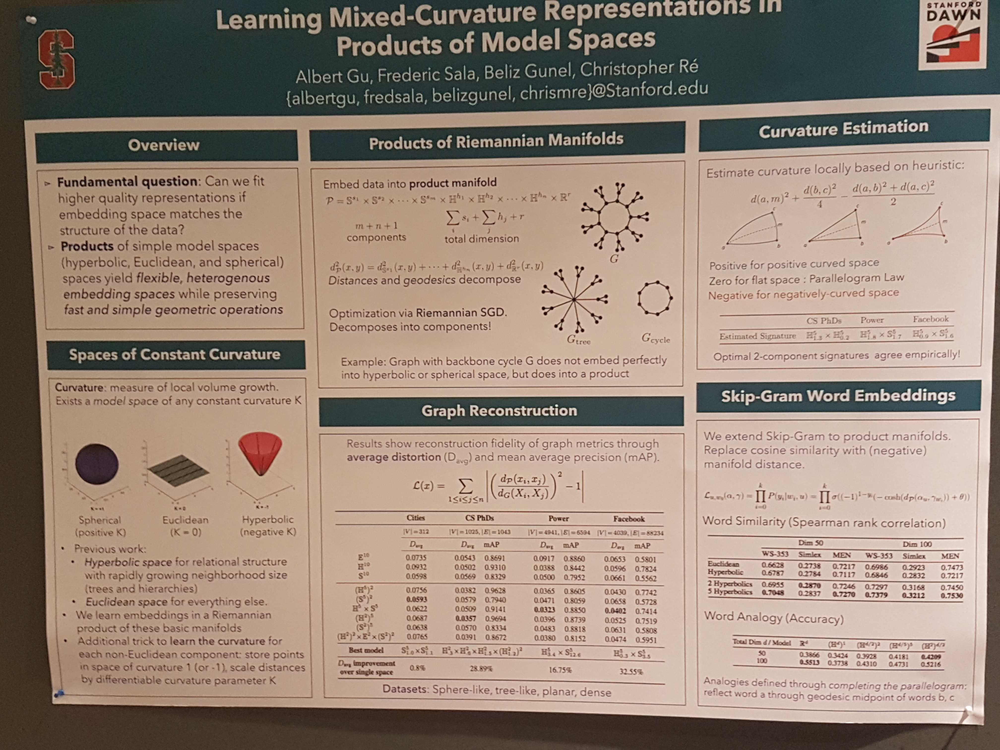

# Summary of ICLR 2019 by ML2 members

## Mon, May 06
### Representation Learning on Graphs and Manifolds
* https://rlgm.github.io/
* More robust benchmark needed.
* Geometric DL for moleular surfaces
* Many people are using GraphSAGE.
* DGL vs. PyTorch Geometry
* Le Song
  * probabilistic logic over knowledge graph
  * counter-example of GNN not being able to represent MLN exists, but can augment the GNN (for example variational GNN by Le Song) to do the job.
  * UW-CSE dataset
* Leskovec
  * Why graph hard?
    * large
    * non-unique representations of the same graph
    * long-range depedenecies
  * Graph generation baselines
    * Kronecker, MMSB, B-A

## Tue, May 07
* Learning Mixed-Curvature Representations in Product Spaces
  * https://openreview.net/forum?id=HJxeWnCcF7
  * 
* PyTorch Expo
  * 
  * PyTorch BigGraph
    * 
  * BoTorch
    * Highly specialized for Bayesian optimization.
    * Not for Bayesian inference therefore no altervative for TFP or Pyro.
    * 1st class support for GPyTorch models.

## Wed, May 08
### RL

## Thu, May 09
